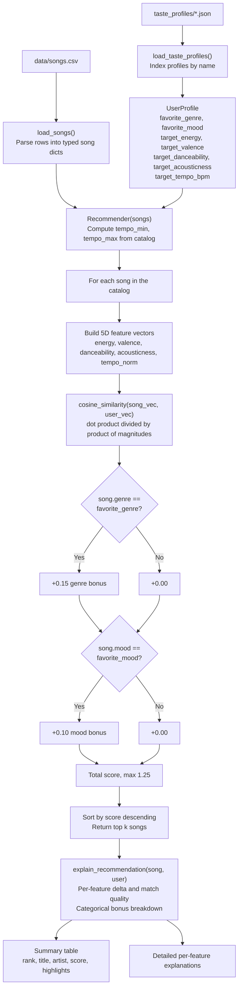

```mermaid
flowchart TD
    CSV["data/songs.csv"]
    PROFILES["taste_profiles/*.json"]

    LOAD["load_songs()\nParse rows into typed song dicts"]
    LOAD_PROFILES["load_taste_profiles()\nIndex profiles by name"]
    USER["UserProfile\nfavorite_genre, favorite_mood\ntarget_energy, target_valence\ntarget_danceability, target_acousticness\ntarget_tempo_bpm"]

    REC["Recommender(songs)\nCompute tempo_min, tempo_max from catalog"]
    LOOP["For each song in the catalog"]
    VEC["Build 5D feature vectors\nenergy, valence, danceability, acousticness, tempo_norm"]
    COSINE["cosine_similarity(song_vec, user_vec)\ndot product divided by product of magnitudes"]

    GENRE{"song.genre ==\nfavorite_genre?"}
    MOOD{"song.mood ==\nfavorite_mood?"}

    G_YES["+0.15 genre bonus"]
    G_NO["+0.00"]
    M_YES["+0.10 mood bonus"]
    M_NO["+0.00"]

    SUM["Total score, max 1.25"]
    SORT["Sort by score descending\nReturn top k songs"]
    EXPLAIN["explain_recommendation(song, user)\nPer-feature delta and match quality\nCategorical bonus breakdown"]
    TABLE["Summary table\nrank, title, artist, score, highlights"]
    DETAIL["Detailed per-feature explanations"]

    CSV --> LOAD
    PROFILES --> LOAD_PROFILES
    LOAD_PROFILES --> USER
    LOAD --> REC
    USER --> REC

    REC --> LOOP
    LOOP --> VEC
    VEC --> COSINE
    COSINE --> GENRE
    GENRE -- Yes --> G_YES
    GENRE -- No  --> G_NO
    G_YES --> MOOD
    G_NO  --> MOOD
    MOOD -- Yes --> M_YES
    MOOD -- No  --> M_NO
    M_YES --> SUM
    M_NO  --> SUM
    SUM --> SORT
    SORT --> EXPLAIN
    EXPLAIN --> TABLE
    EXPLAIN --> DETAIL
```
