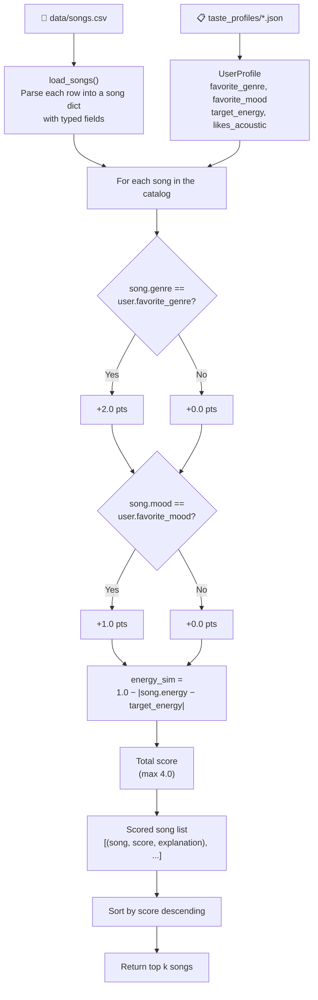

```mermaid
flowchart TD
    CSV["📄 data/songs.csv"]
    PROFILE["📋 taste_profiles/*.json"]

    LOAD["load_songs()\nParse each row into a song dict\nwith typed fields"]
    USER["UserProfile\nfavorite_genre, favorite_mood\ntarget_energy, likes_acoustic"]

    LOOP["For each song in the catalog"]

    GENRE{"song.genre ==\nuser.favorite_genre?"}
    MOOD{"song.mood ==\nuser.favorite_mood?"}
    ENERGY["energy_sim =\n1.0 − |song.energy − target_energy|"]

    G_YES["+2.0 pts"]
    G_NO["+0.0 pts"]
    M_YES["+1.0 pts"]
    M_NO["+0.0 pts"]

    SUM["Total score\n(max 4.0)"]
    SCORED["Scored song list\n[(song, score, explanation), ...]"]
    SORT["Sort by score descending"]
    TOPK["Return top k songs"]

    CSV --> LOAD
    PROFILE --> USER
    LOAD --> LOOP
    USER --> LOOP

    LOOP --> GENRE
    GENRE -- Yes --> G_YES
    GENRE -- No  --> G_NO
    G_YES --> MOOD
    G_NO  --> MOOD

    MOOD -- Yes --> M_YES
    MOOD -- No  --> M_NO
    M_YES --> ENERGY
    M_NO  --> ENERGY

    ENERGY --> SUM
    SUM --> SCORED
    SCORED --> SORT
    SORT --> TOPK
```
